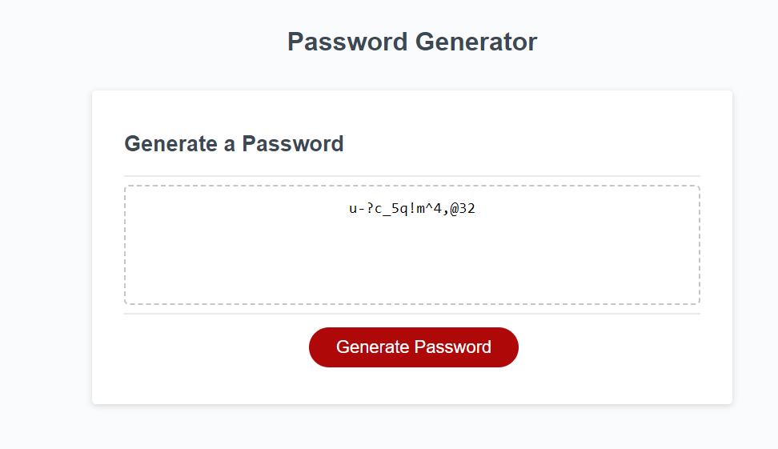

# Password-Generator
Using Javascript to create a password generator, which takes user inputs to determine password length, type of characters, and generates this password on the webpage.

## Deployed Application
[Password Generator](https://benedictcodeshere.github.io/Password-Generator/)

## Description

The aim of the project is to use objects, functions, conditional logic, and loops to create a password generator, which takes a password length, and generates random characters from a selected set of four types:
1. Lowercase
2. Uppercase
3. Numeric
4. Special

## Installation

N/A

## Usage

The way to use the deployed application is to interact with the prompt boxes which appear on screen. The user can specify password length (between 10 and 64 characters inclusive), and whether they wish to include lowercase, uppercase, numeric, or special characters. The user must select at least one of these types. 
The user can click the "Generate" button. On clicking, the user's newly generated password is displayed in the centre of the text box.
## Screenshot Of Deployed Application

## Credits

N/A

## License

Please refer to the license in the repo (MIT License).